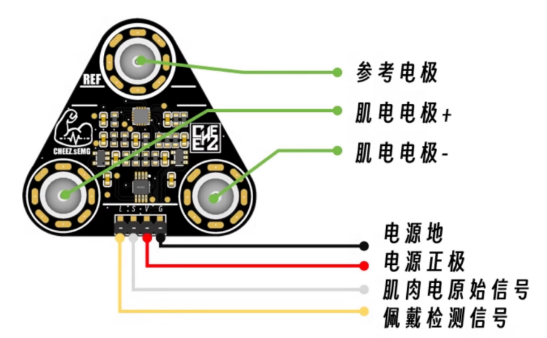
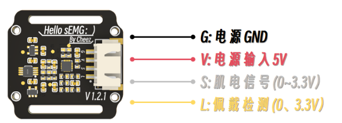
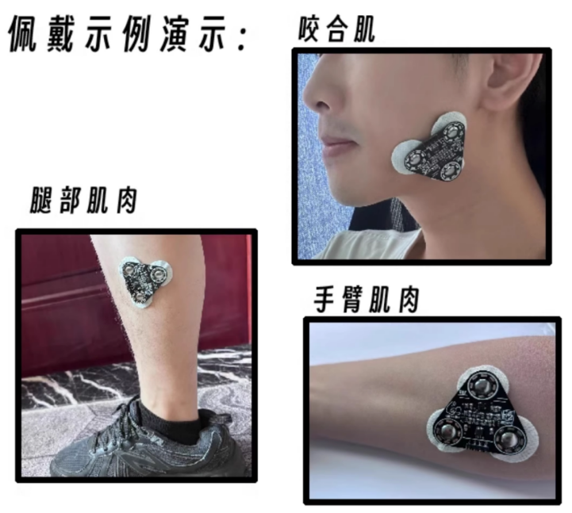
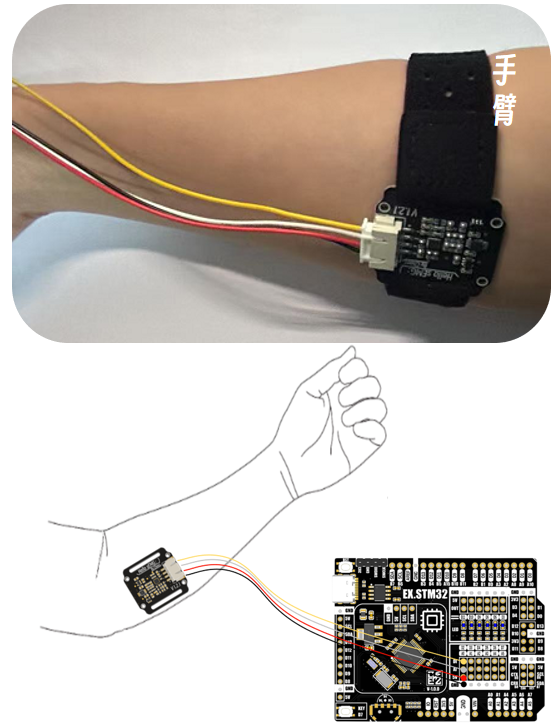
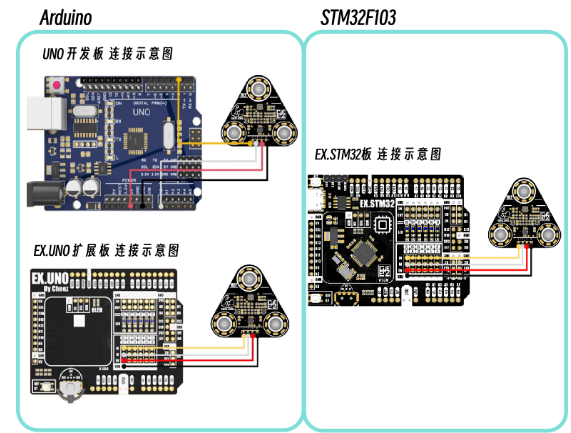
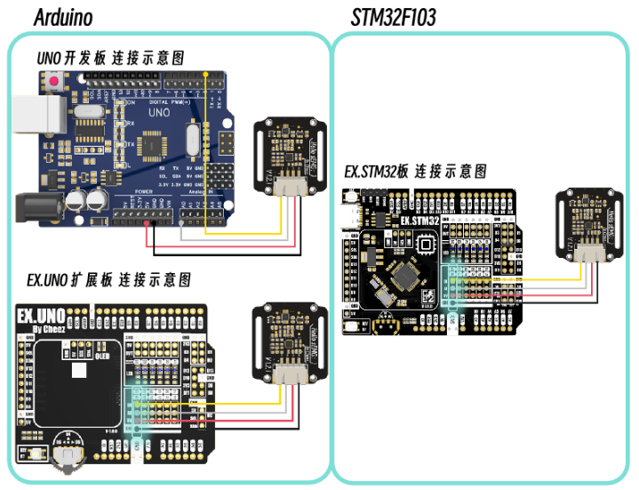
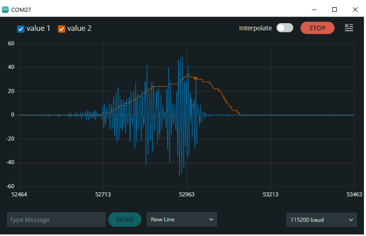

# Cheez.sEMG肌肉电传感器

## 简介

Cheez.sEMG是启思电子推出的一款肌电传感器模块。其能够通过检测人体表面的肌电信号（sEMG）反映肌肉和神经的活动。

本传感器模块集成了滤波、放大电路，将范围在mV甚至uV级别的微弱人体表面肌电信号进行13000倍放大，并通过差分输入、模拟滤波电路的方式对噪音（特别是工频干扰）进行有效抑制。输出信号为模拟量形式，以1.65V为基准电压，0～3.3V量程的输出。输出信号的大小取决于选定肌肉的活动量，输出信号的波形可显著指示被观察位置皮下肌肉的情况，方便做肌电信号的分析与研究，如使用Arduino作为控制器检测肌肉活动情况，如肌肉是否紧绷，强度如何，是否疲劳等。

本产品是一种主动感应传感器，能提供高质量的信号搜集，且易于使用，仅需要一些极为简单的准备工作即可。 本产品的测量具有非侵入性、无创伤、操作简单等优点，可用于人机交互等相关应用。虽然测量肌肉活动历来被用于医学研究，然而随着不断缩小但功能更强大的微控制器和集成电路的完善，肌电图电路和传感器也逐渐被应用于各种控制系统。


### 注意：

1. **电极板保持和肌肉方向一致。**
2. **皮肤干燥时，建议使用导电凝胶或湿巾擦拭电极和皮肤。**
3. **供电电压为5V，供电电流不小于20mA，纹波与其他噪音要小。**
4. **本品并非专业医疗仪器，不能作为辅助配件参与诊断和治疗。**

## 产品参数

- 输入电压：5V-DC
- 输出电压：模拟量(0 - 3.3V)、 数字量(0 / 3.3V)
- 工作电流：< 10mA
- 模块接口：XH2.54-4P  
- 尺寸：
  - 干电极版本：35mm x 33mm
  - 湿电极版本：42mm x45mm

<br/>

## 引脚说明
* 湿电极版本
<br/>


* 干电极版本
<br/>


## 使用教程

### 安装方式

* 湿电极版本
<br/>


* 干电极版本
<br/>


<br/>

### 接线图 
* 湿电极版本
<br/>


* 干电极版本
<br/>

 
<br/>

### 教程

#### 准备

- **软件** 
  * Arduino IDE 2.3
  * 安装Arduino库：管理中安装CheezsEMG库 
  
- **硬件**
  - Arduino UNO开发板 x1
  - EX.UNO控制板x1（可选）
  - sEMG肌电传感器 x 1
  - 干电极 
    - XH2.54端子 转 4Pin杜邦线 x1
    - 腕带 x1   
  - 湿电极
    - 4Pin杜邦线 转 4Pin杜邦线 x1
    - 电极贴 x3

- **连接** 

引脚连接： 
|单片机引脚|传感器引脚|
|--|--|
|D2| L(黄色线)|
|A0| S(白色线)|
|5V| V(红色线)|
|GND| GND(黑色线)|


#### 样例代码

```c_cpp
/* 
串口输出:
        波特率 115200
        采样率：500Hz 

串口输出内容(ASCII码)：
        原始数据，滤波后的肌电信号,包络信号,佩戴检测信号
*/
#include "CheezsEMG.h"

#define SAMPLE_RATE 500        // 采样率
#define BAUD_RATE 115200       // 串口波特率
#define INPUT_PIN A0           // 信号输入(白色)
#define DETECT_PIN 2           // 检测输入(黄色)
 
// 使用默认配置  
CheezsEMG sEMG(INPUT_PIN, DETECT_PIN, SAMPLE_RATE);  

void setup() 
{
  Serial.begin(BAUD_RATE);
  sEMG.begin();  
}  

void loop() 
{   
  if(sEMG.checkSampleInterval())
  {
    sEMG.processSignal();  

    Serial.println(
        String(sEMG.getRawSignal()) + "," +      // 原始数据
        String(sEMG.getFilteredSignal()) + "," + // 滤波数据
        String(sEMG.getEnvelopeSignal()) + "," + // 包络数据
        String(sEMG.getDetectSignal())           // 佩戴情况
    );
  }
} 
```

#### 实验结果

可通过ArduinoIDE上的 ”串口绘图仪“ 
<br/>
 
 

<br/>
